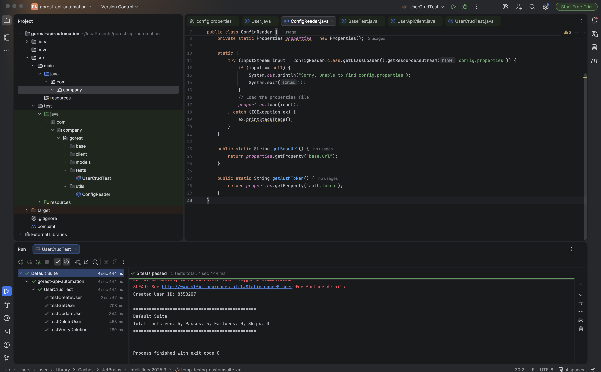
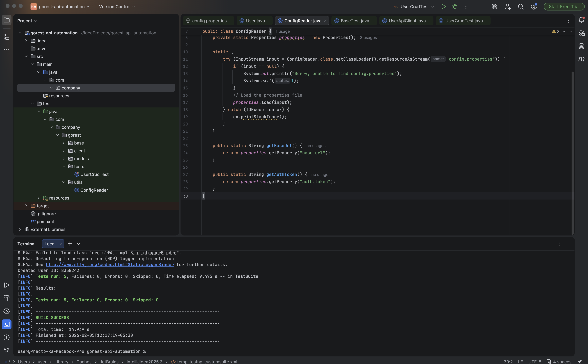
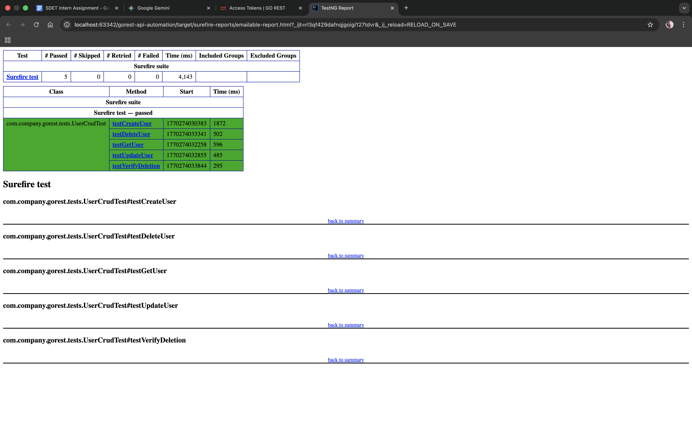

# GoRest API Automation Framework

This project is a robust test automation framework designed to verify the CRUD (Create, Read, Update, Delete) lifecycle of the [GoRest API](https://gorest.co.in/). It is built using **Java**, **RestAssured**, and **TestNG**, following the Page Object Model design pattern for scalability.

## Tech Stack
- **Language:** Java 11+
- **Build Tool:** Maven
- **API Library:** RestAssured
- **Testing Framework:** TestNG
- **Reporting:** TestNG Default Reports / Surefire Reports

## Project Structure
- **`src/test/java/com/company/gorest/base`**:
    - `BaseTest.java`: Handles the global setup, including the Base URL and Authentication (Bearer Token).
- **`src/test/java/com/company/gorest/client`**:
    - `UserApiClient.java`: Contains the HTTP methods (POST, GET, PUT, DELETE) to interact with the API endpoints.
- **`src/test/java/com/company/gorest/models`**:
    - `User.java`: A POJO (Plain Old Java Object) class used for serialization and deserialization of the JSON payload.
- **`src/test/java/com/company/gorest/tests`**:
    - `UserCrudTest.java`: The main test class that orchestrates the full lifecycle flow (Create -> Get -> Update -> Delete -> Verify Deletion).
- **`src/test/java/com/company/gorest/utils`**:
    - `ConfigReader.java`: Utility to securely read the API Token and URL from the properties file.

## Prerequisites
Before running the tests, ensure you have the following installed:
1.  **Java JDK 11** (or higher)
2.  **Maven** (installed via Homebrew or bundled with IntelliJ)

## How to Run the Tests

### Option 1: Via Command Line (Terminal)
Navigate to the project root directory and run:
```bash
mvn test
```
 
## How to Run (Via IntelliJ IDE)
1.  Open the project in IntelliJ.
2.  Navigate to `src/test/java/com/company/gorest/tests/UserCrudTest.java`.
3.  Look for the class declaration `public class UserCrudTest`.
4.  Click the **Green Play Button (▶)** next to the class name (line 10).
5.  Select **Run 'UserCrudTest'**.

##  Test Scenarios Covered
1.  **Create User (POST):** Verifies the creation of a new user and validates the `201 Created` status.
2.  **Get User (GET):** Fetches the created user by ID to ensure data persistence (`200 OK`).
3.  **Update User (PUT):** Updates user details (Name) and verifies the change (`200 OK`).
4.  **Delete User (DELETE):** Removes the user from the system (`204 No Content`).
5.  **Negative Test:** Attempts to fetch the deleted user to confirm they no longer exist (`404 Not Found`).

## Configuration
The API Base URL and Bearer Token are managed in the properties file:
`src/test/resources/config.properties`

```properties
base.url=[https://gorest.co.in](https://gorest.co.in)
auth.token=YOUR_ACCESS_TOKEN_HERE
```
## 📸 Execution Proof (Screenshots)

### 1. IntelliJ Test Results (Green Checkmarks)


### 2. Terminal Execution (Maven Build Success)


### 3. Official HTML Test Report
